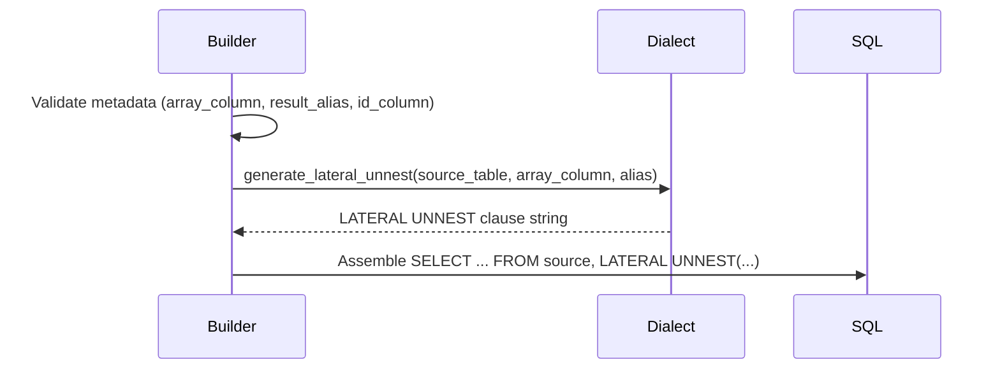

# CTE Infrastructure Architecture

**Last Updated**: 2025-11-02  
**Related Tasks**: SP-011-001 → SP-011-012, SP-011-015, SP-011-016  
**Audience**: Developers extending the unified SQL pipeline.

---

## 1. Purpose

The CTE infrastructure bridges the translator's SQL fragments and the dialect layer. It introduces population-first templates, dependency management, and array flattening to produce monolithic SQL statements suitable for large-scale analytics. This document explains how the builder and assembler cooperate, how UNNEST mechanics are implemented, and how dialect abstractions remain thin.

## 2. Component Diagram

```mermaid
graph TD
    subgraph Translator (PEP-003)
        SF[SQLFragment]
    end
    subgraph CTE Infrastructure (PEP-004)
        CB[CTEBuilder]
        CA[CTEAssembler]
    end
    subgraph Dialect Layer
        DD[DuckDBDialect]
        PG[PostgreSQLDialect]
    end

    SF --> CB --> CA --> DD
    CA --> PG
```

- **SQLFragment**: Output from the translator; contains raw expression text plus metadata.
- **CTEBuilder**: Converts fragments into `CTE` objects, wrapping expressions in SELECT templates and invoking dialect helpers for UNNEST.
- **CTEAssembler**: Orders CTEs, formats the WITH clause, and appends the final SELECT.
- **Dialects**: Provide syntax helpers such as `generate_lateral_unnest` and `json_extract`. No business logic is permitted here.

## 3. CTE Data Model

| Field | Description |
|-------|-------------|
| `name` | Stable identifier (`cte_1`, `name_cte`). Used for dependencies and final SELECT. |
| `query` | Query body (no surrounding WITH clause). |
| `depends_on` | Names of prerequisite CTEs; used by the assembler's topological sort. |
| `requires_unnest` | Flags that the fragment must be wrapped in a LATERAL UNNEST. |
| `source_fragment` / `source_expression` | Traceability links back to the translator for debugging. |
| `metadata` | Extensible dictionary (array alias, projection expression, id column, result alias, hints). |

Validation happens in `CTE.__post_init__`, ensuring identifiers are SQL-safe and metadata types are correct.

## 4. Builder Mechanics

1. **Name Generation**: `_generate_cte_name` increments a counter to produce deterministic identifiers. Determinism keeps snapshot diffs small and ensures reproducible SQL.
2. **Source Resolution**: Non-root fragments inherit the previous CTE name as their source table to maintain population context.
3. **Template Selection**:
   - `_wrap_simple_query` is used for scalar projections. It always preserves the `id` column and assigns a `result_alias`.
   - `_wrap_unnest_query` is used when `fragment.requires_unnest` is set.
4. **Dependency Preservation**: The previous CTE name and fragment-level dependencies are merged. Duplicates are stripped while preserving order so assembler diagnostics remain intuitive.

### LATERAL UNNEST Flow



- **DuckDB**: `LATERAL UNNEST({array_expr}) AS {alias}`
- **PostgreSQL**: `LATERAL jsonb_array_elements({array_expr}) AS {alias}(value)`

The builder does not interpret array semantics; it simply marshals metadata to the dialect helper.

## 5. Assembler Mechanics

### 5.1 Dependency Ordering

- Implements Kahn's algorithm with an insertion-order tie breaker.
- Validates duplicates, missing dependencies, and cycles.
- When a cycle is detected, `_find_dependency_cycle` produces a human-readable path (`cte_a → cte_b → cte_a`).

### 5.2 WITH Clause Formatting

```text
WITH
  cte_1 AS (
    SELECT ...
  ),
  cte_2 AS (
    SELECT ...
  )
SELECT * FROM cte_2;
```

- `_normalize_query_body` trims inconsistent indentation using `inspect.cleandoc`.
- `_indent_query_body` indents by four spaces for readability.
- The closing `);` lines are generated consistently to keep diffs stable across dialects.

### 5.3 Final SELECT

- Always projects `SELECT * FROM {final_cte};` so downstream code can choose specific columns or wrap results further.
- Population-first design means the final CTE already carries all necessary identifiers.

## 6. Dialect Abstraction

| Capability | DuckDBDialect | PostgreSQLDialect | Notes |
|------------|---------------|-------------------|-------|
| `generate_lateral_unnest` | Uses native `UNNEST` | Uses `jsonb_array_elements` | Syntax-only difference; identical semantics |
| `execute_query` | Executes against in-memory DuckDB | Stubbed for SQL verification (Sprint 011) | PostgreSQL execution to be enabled once CI infra lands |
| JSON helpers | `json_extract`, `json_group_array`, etc. | `jsonb_extract_path_text`, `json_agg`, etc. | Provided by existing translator contracts |

Future dialects (e.g., BigQuery) must implement the same helper surface without embedding business rules.

## 7. Array Navigation Example

1. Translator emits a fragment for `Patient.name` with metadata:
   ```json
   {
     "array_column": "json_extract(resource, '$.name')",
     "result_alias": "name_item",
     "projection_expression": "name_item"
   }
   ```
2. Builder wraps it into:
   ```sql
   SELECT resource.id,
          name_item AS name_item
   FROM resource,
        LATERAL UNNEST(json_extract(resource, '$.name')) AS name_item
   ```
3. A second fragment for `Patient.name.given` depends on `cte_1`; builder sets `depends_on=["cte_1"]` and forwards metadata for the nested array.
4. Assembler orders `[cte_1, cte_2]`, formats the WITH clause, and produces:
   ```sql
   WITH
     cte_1 AS (
       ...
     ),
     cte_2 AS (
       ...
     )
   SELECT * FROM cte_2;
   ```

## 8. Performance Characteristics

- Builder and assembler run in <0.1 ms per stage on the Sprint 011 compliance run (100 patients, DuckDB).
- Benchmark suite enforces <10 ms CTE builds and <150 ms execution for 1,000-patient datasets.
- Row-by-row baseline is ≥10x slower for every path navigation expression (see `tests/benchmarks/fhirpath/test_cte_performance.py`).
- Memory increase remains <100 MB even for 1,000-patient datasets with nested arrays.

## 9. Extension Guidance

- **New Dialects**: Implement `generate_lateral_unnest`, ensure JSON helpers match translator expectations, and plug them into the executor. No new business rules allowed.
- **Additional FHIRPath Features**: Translator must populate metadata for new operations; CTE layer should require no changes unless new SQL constructs are needed.
- **Performance Improvements**: Consider metadata hints for predicate pushdown or column selection; store them in `CTE.metadata` to avoid signature churn.
- **Observability**: Use `FHIRPathExecutor.execute_with_details` to feed metrics into telemetry systems.

---

**References**
- `fhir4ds/fhirpath/sql/cte.py`
- `fhir4ds/fhirpath/sql/executor.py`
- `tests/benchmarks/fhirpath/test_cte_performance.py`
- `project-docs/compliance/sprint-011-results.md`
