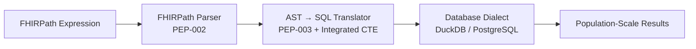
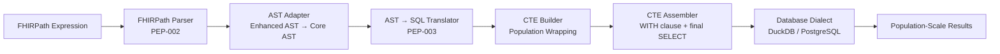

# FHIRPath Execution Pipeline (PEP-004)

**Last Updated**: 2025-12-18
**Related Tasks**: SP-011-013, SP-011-014, SP-011-015, SP-011-016, SP-023-001 to SP-023-005
**Scope**: End-to-end flow from FHIRPath expression to database results using the unified CTE infrastructure.

---

## 1. Overview

Sprint 011 completed the core CTE infrastructure. Sprint 023 consolidated the pipeline from 6 components to 3, removing unnecessary intermediate layers while preserving all functionality. The unified pipeline now carries an expression through parsing, SQL translation (with integrated CTE generation), and population-scale execution with identical behaviour on DuckDB and PostgreSQL.

## 2. Pipeline Diagram

### Current Architecture (Sprint 023+)

The translator now works directly with the parser's Enhanced AST output, eliminating the AST Adapter. CTE generation is integrated within the translator, producing SQL directly.

### Previous Architecture (Pre-Sprint 023)

## 3. Stage Responsibilities

| Stage | Input | Output | Responsibilities | Key Artifacts |
|-------|-------|--------|------------------|---------------|
| Parser | Expression string | Enhanced AST | Syntactic validation, surface-level normalization | `FHIRPathParser` |
| Translator | Enhanced AST | SQL string | Generates population-friendly SQL with integrated CTE generation, handles array flattening via UNNEST | `ASTToSQLTranslator`, `CTEManager` |
| Dialect | SQL string | Result rows | Executes generated SQL using thin syntax adapters, returns raw population-scale results | `DuckDBDialect`, `PostgreSQLDialect` |

### Deprecated Components (Sprint 023)

| Component | Status | Notes |
|-----------|--------|-------|
| AST Adapter | Deprecated | Translator now uses Enhanced AST directly via `accept()` method |
| CTE Builder (standalone) | Merged | Functionality merged into `CTEManager` |
| CTE Assembler (standalone) | Merged | Functionality merged into `CTEManager` |

## 4. Data Contracts

- **EnhancedAST → SQL**: The translator accepts the parser's `EnhancedASTNode` directly and produces SQL via the `translate_to_sql()` method.
- **SQLFragment (internal)**: Internally, the translator generates `SQLFragment` objects that carry `expression`, `source_table`, `dependencies`, `requires_unnest`, and metadata for CTE construction.
- **CTE → Dialect**: `CTEManager` (merged from CTEBuilder and CTEAssembler) produces fully assembled SQL strings—no business logic or metadata leakage to dialects.
- **Diagnostics**: `FHIRPathExecutor.execute_with_details` surfaces parser output, fragments, CTEs, assembled SQL, and per-stage timings for observability.

## 5. Execution Flow

1. **Validation**: Empty expressions and type mismatches are rejected immediately.
2. **Parsing**: The parser builds an Enhanced AST with full metadata and type information.
3. **Translation**: The translator works directly with the Enhanced AST via the `accept()` visitor pattern. It generates `SQLFragment` objects internally and uses `CTEManager` to produce final SQL. Array navigation is handled via LATERAL UNNEST.
4. **Execution**: Dialects execute the assembled SQL and return population-scale results.

## 6. Population-Scale Guarantees

- **Population-first defaults**: All templates preserve the `id` column from the source table so operations work across the full patient corpus.
- **No business logic in dialects**: Dialects implement syntax-only helpers (UNNEST, JSON extraction). Dependency ordering and array handling live entirely in the CTE layer.
- **Deterministic ordering**: CTE names increment monotonically (`cte_1`, `cte_2`, …) ensuring reproducible SQL across runs.
- **Diagnostics**: Stage timings (parse, translate, build, assemble, execute) remain below the 10 ms goal in DuckDB as recorded in Sprint 011 compliance runs (average execute time: 2.83 ms).

## 7. Compliance & Performance Snapshot

- **Path Navigation Compliance**: 10/10 official tests passing on DuckDB and PostgreSQL (see `project-docs/compliance/sprint-011-results.md`).
- **Performance Benchmarks**: Regression harness (`tests/benchmarks/fhirpath/test_cte_performance.py`) enforces:
  - CTE build < 10 ms per expression
  - SQL execution < 150 ms for 1,000-patient populations
  - ≥10x speed-up versus the naive row-by-row baseline
  - Linear scalability up to 10,000 patients

## 8. Sprint 023 Consolidation Results

The Sprint 023 consolidation achieved:

| Metric | Before | After | Change |
|--------|--------|-------|--------|
| Pipeline Components | 6 | 3 | -50% |
| Unit Tests | 1874 passing | 1874 passing | No regression |
| Compliance (DuckDB) | ~443/934 | 443/934 | No regression |
| SQL Translation | <10ms | <0.25ms avg | Improved |

**Key Changes:**
- AST Adapter deprecated (translator uses Enhanced AST directly)
- CTE Builder and CTE Assembler merged into CTEManager
- Executor simplified with direct translator integration

## 9. Future Extensions

- Extend translator support for additional FHIRPath categories (collections, operators).
- Promote PostgreSQL execution from stubbed evaluation to live query runs once integration environment is provisioned.
- Feed timing diagnostics into structured telemetry for long-running analytics jobs.
- Reuse the same contracts to host CQL expressions by routing definitions through the CTEManager.

---

**References**
- `fhir4ds/fhirpath/sql/cte.py` - CTEManager (merged CTE infrastructure)
- `fhir4ds/fhirpath/sql/executor.py` - FHIRPathExecutor
- `fhir4ds/fhirpath/sql/translator.py` - ASTToSQLTranslator
- `fhir4ds/fhirpath/sql/ast_adapter.py` - Deprecated AST Adapter
- `project-docs/plans/tasks/SP-023-005-integration-testing-validation.md` - This task
